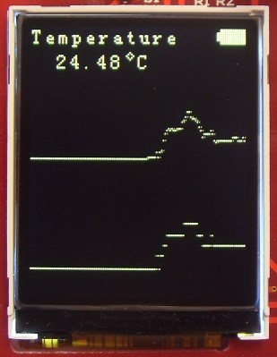
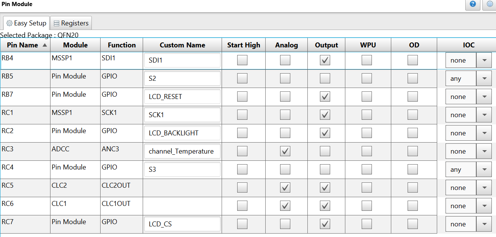

  <article class="markdown-body entry-content p-3 p-md-6" itemprop="text">

# Introduction
The PIC16F184xx family has a new Analog to Digital Converter with Computation (ADCC) with a 12-bit resolution. This project shows the reading of an analog temperature sensor (MCP9701) using the ADCC.

# Description
In this example we will be using the PIC16F18446 Sensor Board. The PIC reads the temperature sensor, and displays the temperature on the LCD. The sensor has a temperature coefficient of 19.5 mV/°C. It is sensitive enough to detect the heat of the user's hand from a distance of 1 cm. Here is a picture of the temperature sensor:

The current temperature is displayed (in Celsius) on the LCD. Also, two graphs display the variations of the 12-bit and 10-bit temperature values in real time.

# MCC Settings

Here are the settings used for MSSP, CLC, FVR, and ADCC. MSSP + CLC are used for the LCD control.
### MSSP Settings

### CCL Settings

### FVR Settings

### ADCC settings

### PIN Grid

### PIN Module

