

## PIC16F18446 Sensor Board Temperature Measurement

The PIC16F184xx family has a new Analog to Digital Converter with Computation (ADCC) with a 12-bit resolution. This project shows the reading of an analog temperature sensor (MCP9701) using the ADCC.

In this example we will be using the PIC16F18446 Sensor Board. The PIC reads the temperature sensor, and displays the temperature on the LCD. The sensor has a temperature coefficient of 19.5 mV/°C. It is sensitive enough to detect the heat of the user's hand from a distance of 1 cm. Here is a picture of the temperature sensor:

 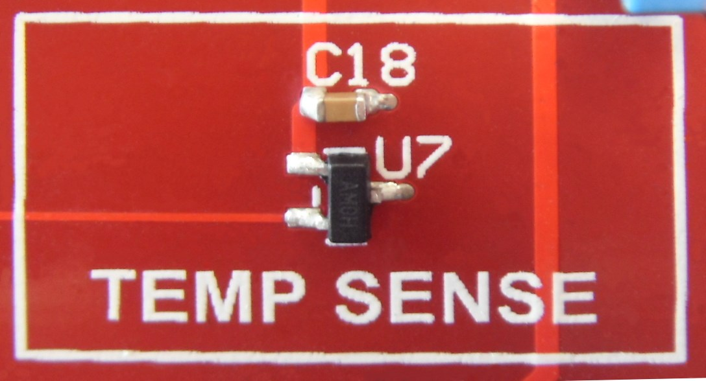

## Related Documentation
- [PIC16F18446 Product Family Page](https://www.microchip.com/design-centers/8-bit/pic-mcus/device-selection/pic16f18446)
- [PIC16F18446 datasheet](http://ww1.microchip.com/downloads/en/DeviceDoc/40001985B.pdf) for more information or specifications.

## Software Used

- [MPLAB® X IDE](http://www.microchip.com/mplab/mplab-x-ide) v6.15 or newer
- [MPLAB® XC8](http://www.microchip.com/mplab/compilers) v2.45 or newer
- [PIC16F1xxxx_DFP](https://packs.download.microchip.com/) v1.2.99

## Hardware Used
- [PIC16F18446 Sensor Board Quick Start Guide](http://ww1.microchip.com/downloads/en/DeviceDoc/30010172A.pdf)
   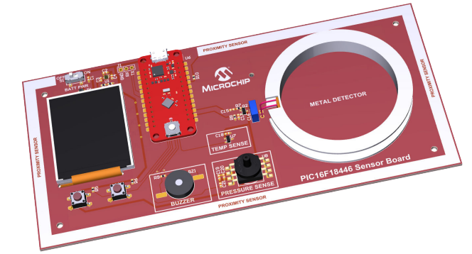

## Operation

To program the microcontroller with this MPLAB X project, follow the steps provided in the [How to Program the Microcontroller](#how-to-program-the-microcontroller) chapter.  

## Setup

The following configurations must be made for this project:

- Clock Control:
  - Clock Source: HFINTOSC
  - HF Internal Clock: 32 MHz
  - Clock Divider: 1

   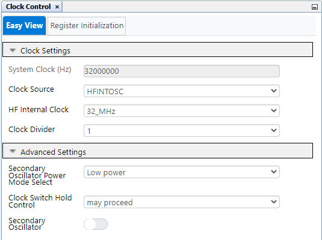

- Configuration bit:
  - External Oscillator Selection bits: Oscillator not enabled
  - Reset Oscillator Selection bits: HFINTOSC (1MHz)
  - WDT Operating Mode bits: WDT Disabled, SWDTEN is ignored

   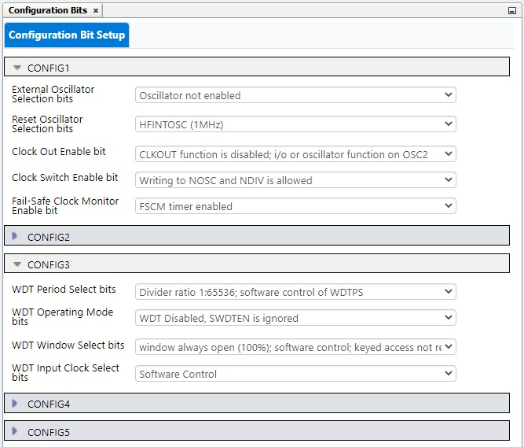

- MSSP1 (SPI):
  - Mode: Host
  - SPI Mode: SPI Mode 0
  - Input data sampled at: Middle
  - Clock source selection: FOSC/4

   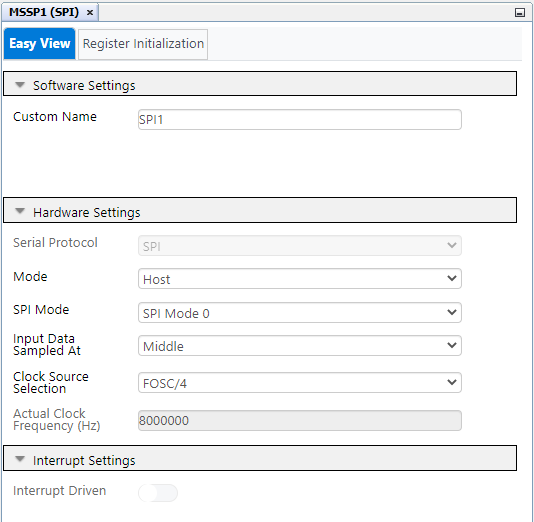
  
- CLC1:
  - Enable CLC: Yes
  - Logic cell mode bits: AND-OR

   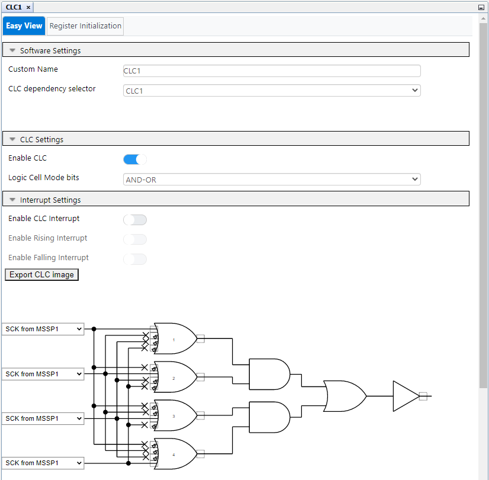
  
- CLC2:
  - Enable CLC: Yes
  - Logic cell mode bits: AND-OR

   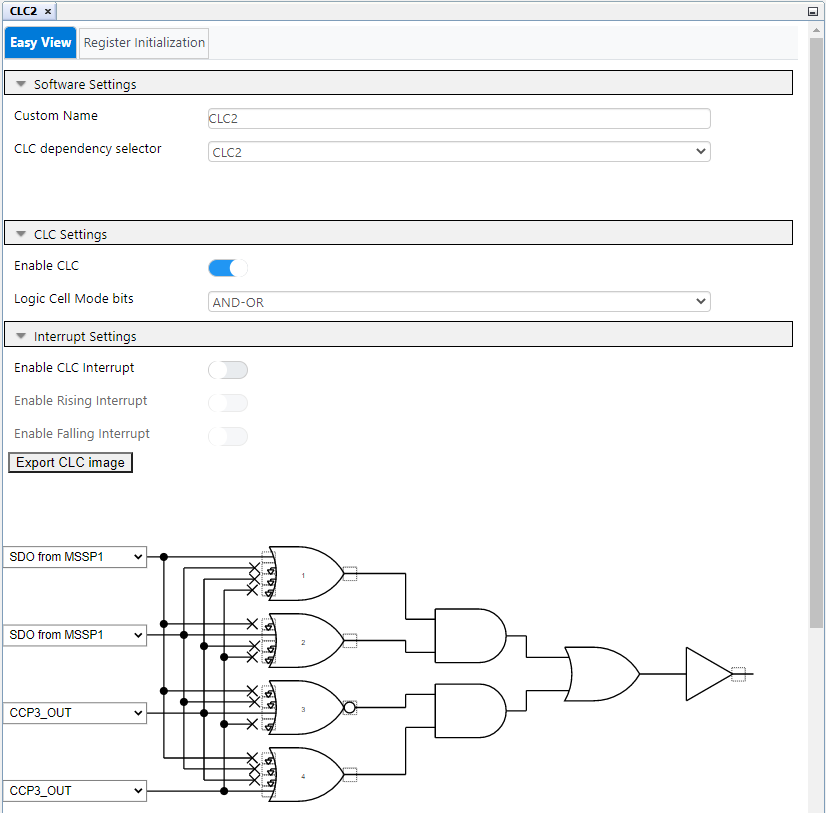

- FVR:
  - Enable FVR: Yes
  - FVR buffer gain to ADC: 1x
  - FVR buffer gain to other peripherals: 1x

   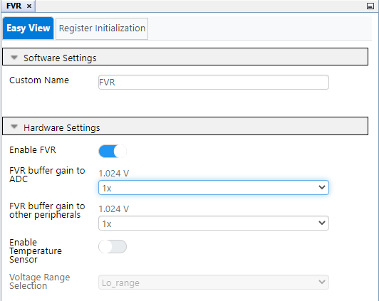
  
- ADCC:
  - Enable ADC: Yes
  - Operating Mode: Burst average mode
  - Result Alignment: Right
  - Positive Input Channel: ANC3
  - Positive Reference: FVR
  - Negative Reference: VSS
  - Auto-conversion Trigger: Disabled
  - Acquisition Count: 0
  - Clock Source: FOSC
  - Clock Divider: FOSC/128
  - Repeat: 64

   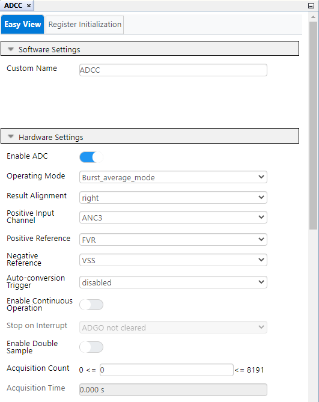 
   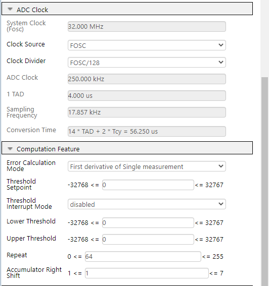

  
| Pin | Configuration  |        Description        |        Custom Name        |
| :-: | :------------: | :-----------------------: | :-----------------------: |
| RC1 |      SCK1      |        Serial Clock       |            SCK1           |        
| RB4 |      SDI1      |       Serial Data In      |             S3            |
| RC5 |      CLC2      |       Analog output       |           IO_RC5          | 
| RC6 |      CLC1      |       Analog output       |           IO_RC6          |
| RC3 |      ADCC      |        Analog input       |     channel_Temperature   |
| RB5 |      GPIO      |       Digital input       |             S2            |
| RB7 |      GPIO      |       Digital output      |         LCD_RESET         |
| RC2 |      GPIO      |       Digital output      |       LCD_BACKLIGHT       |
| RC4 |      GPIO      |       Digital input       |           IO_RC4          | 
| RC7 |      GPIO      |       Digital output      |           LCD_CS          |

 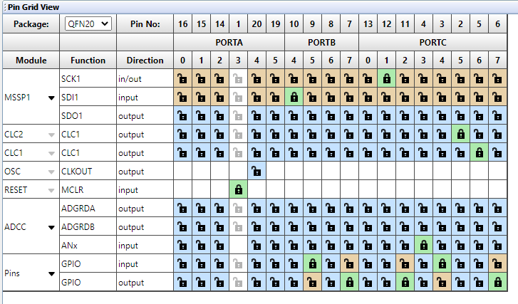
 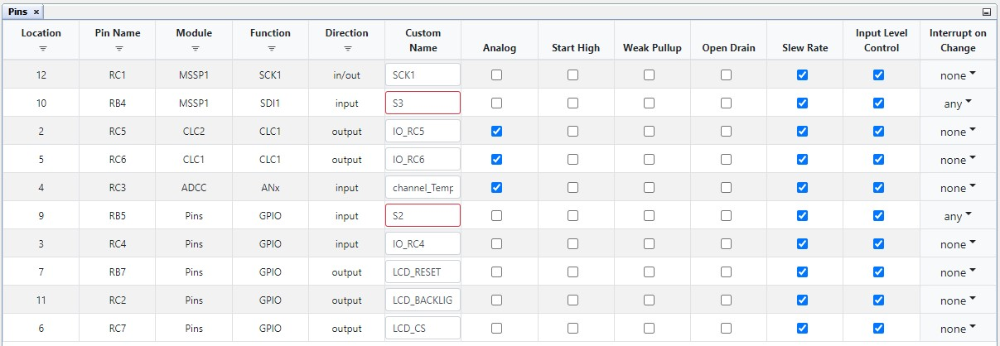

## Demo

The current temperature is displayed (in Celsius) on the LCD. Also, two graphs display the variations of the 12-bit and 10-bit temperature values in real time.

 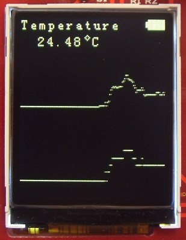

## Summary

This code example shows how to use the temperature sensor on the Sensor Board, featuring MSSP, CLC, FVR and ADCC peripherals.

## How to Program the Microcontroller

This chapter demonstrates how to use the MPLAB X IDE to program a PIC® device with an `Example_Project.X`. This applies to other projects.

1.  Connect the Sensor board to the PC.

2.  Open the `Example_Project.X` project in MPLAB X IDE.

3.  Set the `Example_Project.X` project as main project.
     Right click the project in the **Projects** tab and then Set as Main Project.
     

4.  Clean and build the `Example_Project.X` project.
     Right click the `Example_Project.X` project and select Clean and Build.
     

5.  Select Starter Kits (PKOB) in the Connected Hardware Tool section of the project settings:
     Right click the project and **Properties**.
     Click the arrow under the Connected Hardware Tool, and from the dropdown, select Starter Kits (PKOB) by clicking the SN.
     Click **Apply** and then **OK**.
     

6.  Program the project to the microcontroller.
     Right click the project and then Make and Program Device.
     

 

- [Back to Top](#pic16f18446-sensor-board-temperature-measurement)
- [Back to Setup](#setup)
- [Back to Demo](#demo)
- [Back to Summary](#summary)