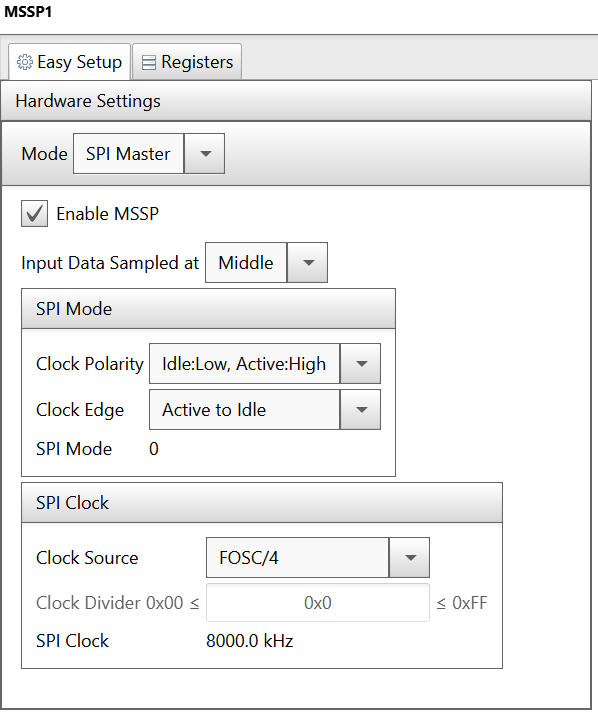
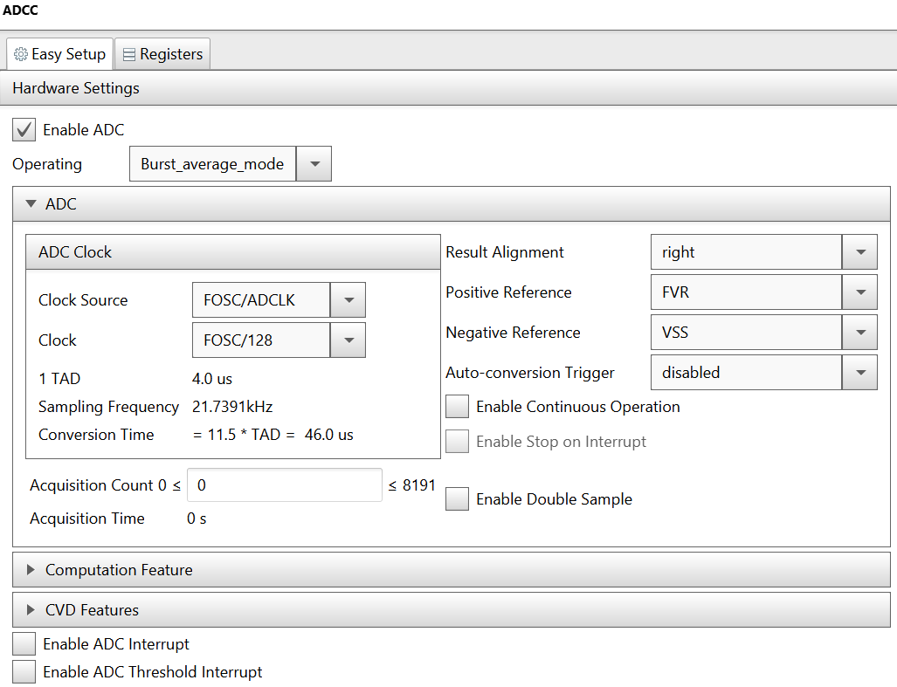
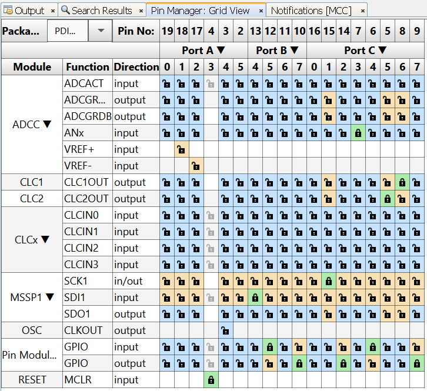
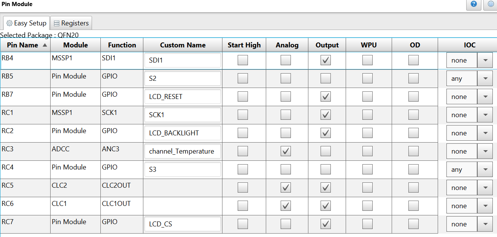

# PIC16F18446 Sensor Board Temperature Measurement

The PIC16F184xx family has a new Analog to Digital Converter with Computation (ADCC) with a 12-bit resolution. This project shows the reading of an analog temperature sensor (MCP9701) using the ADCC.

In this example we will be using the PIC16F18446 Sensor Board. The PIC reads the temperature sensor, and displays the temperature on the LCD. The sensor has a temperature coefficient of 19.5 mV/°C. It is sensitive enough to detect the heat of the user's hand from a distance of 1 cm. Here is a picture of the temperature sensor:

 

The current temperature is displayed (in Celsius) on the LCD. Also, two graphs display the variations of the 12-bit and 10-bit temperature values in real time.

 

## Related Documentation
- [PIC16F18446 Product Family Page](https://www.microchip.com/design-centers/8-bit/pic-mcus/device-selection/pic16f18446)
- [PIC16F18446 datasheet](http://ww1.microchip.com/downloads/en/DeviceDoc/40001985B.pdf) for more information or specifications.

## Software Used
- MPLAB® X IDE 5.30 or newer [(microchip.com/mplab/mplab-x-ide)](http://www.microchip.com/mplab/mplab-x-ide)
- MPLAB® XC8 2.10 or a newer compiler [(microchip.com/mplab/compilers)](http://www.microchip.com/mplab/compilers)
- MPLAB® Code Configurator (MCC) 3.95.0 or newer [(microchip.com/mplab/mplab-code-configurator)](https://www.microchip.com/mplab/mplab-code-configurator)
- MPLAB® Code Configurator (MCC) Device Libraries 8-bit AVR MCUs 2.3.0 or newer [(microchip.com/mplab/mplab-code-configurator)](https://www.microchip.com/mplab/mplab-code-configurator)
- PIC16F1xxxx DFP 1.2.99 or newer Device Pack

## Hardware Used
- [PIC16F18446 Sensor Board Demonstration](https://www.microchip.com/promo/pic16f18446-sensor-board-demonstration)

## Setup

### MCC Settings

Here are the settings used for MSSP, CLC, FVR, and ADCC. MSSP + CLC are used for the LCD control.
### MSSP Settings

 

### CCL Settings
 

 

### FVR Settings
 

### ADCC settings
 

 

### PIN Grid
 

### PIN Module
 

## Demo

 